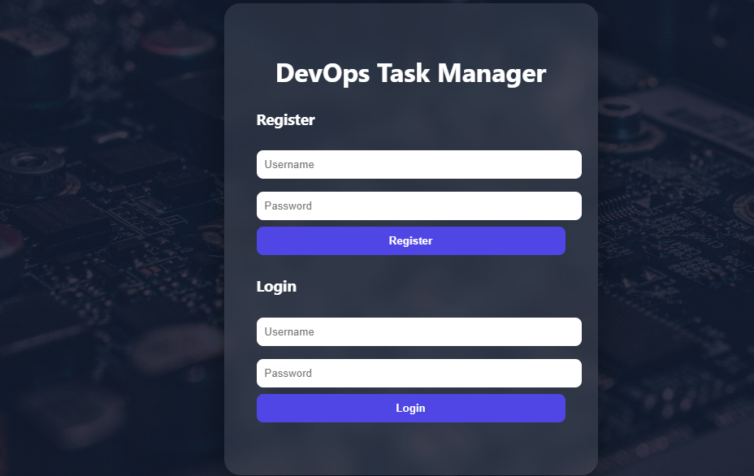
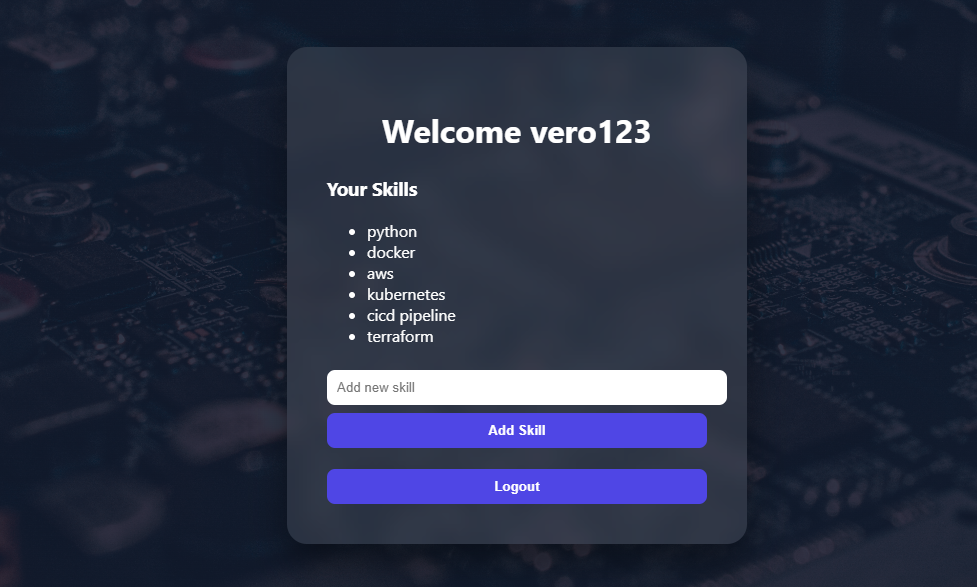
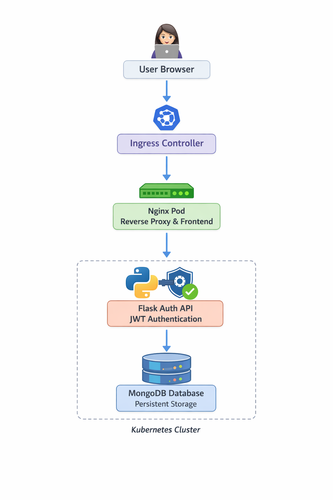

# 🚀 DevOps Task Manager

A **production-style microservices application** demonstrating modern DevOps practices including **Docker containerization, Kubernetes orchestration, Helm deployments, and environment-based configuration management**.

The application implements **secure authentication, user-scoped dashboards, and dynamic profile management using JWT**, deployed through a **fully containerized microservices architecture**.

---

# 📌 Overview

DevOps Task Manager is a **multi-user web application** built with:

- 🐍 **Flask** – Authentication service  
- 🌐 **Nginx** – Reverse proxy + frontend server  
- 🍃 **MongoDB** – Persistent database  
- 🐳 **Docker** – Containerization  
- ☸️ **Kubernetes** – Container orchestration  
- ⚙️ **Helm** – Kubernetes package management  
- 🏗 **Infrastructure as Code Ready** – Terraform-compatible structure  


Snapshots:-

  
  


The application allows users to:

✔ Register securely  
✔ Login using JWT authentication  
✔ Access a personalized dashboard  
✔ Add and manage skills dynamically  
✔ Persist user data across container restarts  
✔ Deploy the application using Kubernetes and Helm  

---

  

# 🧩 System Architecture Diagram

             ┌──────────────────────┐
             │      User Browser     │
             └──────────┬────────────┘
                        │
                        ▼
             ┌──────────────────────┐
             │   Kubernetes Ingress │
             └──────────┬────────────┘
                        │
                        ▼
             ┌──────────────────────┐
             │       Nginx Pod       │
             │  Reverse Proxy + UI  │
             └──────────┬────────────┘
                        │
                        ▼
             ┌──────────────────────┐
             │   Flask Auth Service  │
             │      (JWT API)        │
             └──────────┬────────────┘
                        │
                        ▼
             ┌──────────────────────┐
             │      MongoDB Pod      │
             │    Persistent Data    │
             └──────────────────────┘


---

# 🔹 Microservices Architecture

The application follows a **microservices-based design**.

| Service | Technology | Purpose |
|------|------|------|
| Frontend | Nginx | Serves UI and acts as reverse proxy |
| Auth Service | Flask | Handles authentication & API logic |
| Database | MongoDB | Stores users and skills |
| Deployment | Kubernetes | Orchestrates containers |
| Packaging | Helm | Manages Kubernetes application deployments |

Services communicate through **internal Kubernetes networking**.

---

# 🔐 Features

✔ Multi-user authentication system  
✔ JWT-based stateless authentication  
✔ User-specific dashboards  
✔ Dynamic skill management  
✔ MongoDB persistent storage  
✔ Reverse proxy configuration  
✔ Dockerized microservices  
✔ Kubernetes orchestration  
✔ Helm-based deployments  
✔ Environment-specific configuration  

---


---

# 🐳 Running the Application (Docker)

### 1️⃣ Clone Repository

```bash
git clone https://github.com/your-repo/devops-task-manager.git
cd devops-task-manager

2️⃣ Start Containers
docker compose up --build

3️⃣ Access Application
http://localhost

☸️ Kubernetes Deployment

Apply Kubernetes manifests:

kubectl apply -f k8s/

Verify deployment:

kubectl get pods
kubectl get svc
kubectl get ingress

⚙️ Helm Deployment

Helm packages the entire application for easy deployment.

Install Application
helm install task-dev ./task-manager-chart -f task-manager-chart/values-dev.yaml
Upgrade Deployment
helm upgrade task-dev ./task-manager-chart -f task-manager-chart/values-dev.yaml
Uninstall Deployment
helm uninstall task-dev

helm upgrade task-dev ./task-manager-chart -f task-manager-chart/values-dev.yaml
Uninstall Deployment
helm uninstall task-dev

Deploy Production
helm install task-prod ./task-manager-chart -f values-prod.yaml

Each environment can have different:

replicas
domain names
resource limits
environment variables

🚀 DevOps Practices Demonstrated

✔ Containerization with Docker
✔ Microservices architecture
✔ Reverse proxy pattern
✔ Kubernetes orchestration
✔ Helm-based deployments
✔ Environment-based configuration
✔ Infrastructure-ready architecture

🎯 Future Improvements

Terraform infrastructure automation
CI/CD pipeline automation
Role-based access control (RBAC)
Token refresh mechanism
Skill edit/delete functionality in website
Rate limiting
GitOps deployment (ArgoCD)
Monitoring stack (Prometheus + Grafana)
